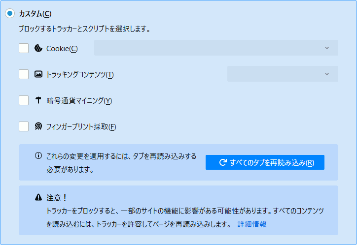
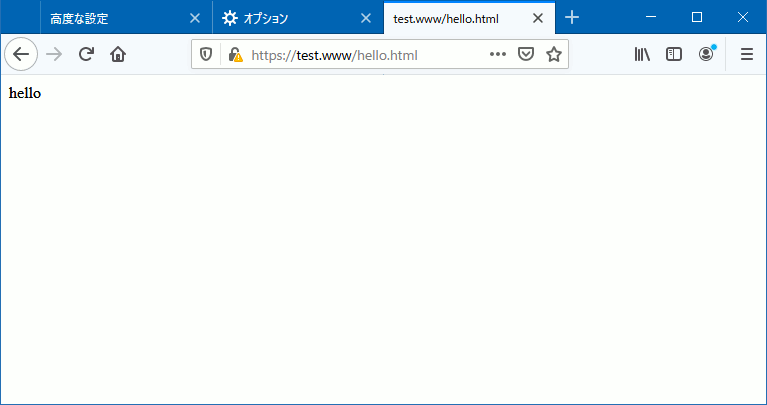
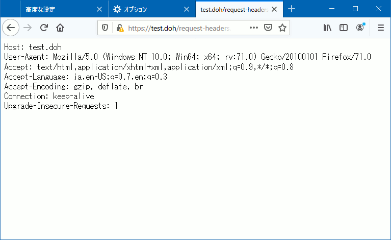
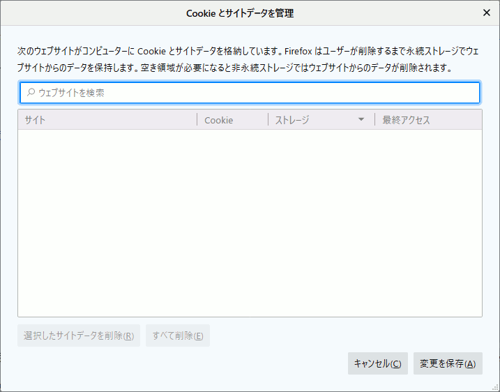

# DoH + Set-Cookie で興味関心が丸裸！？

こんにちは、広告エンジニアの中山です。<br />
皆さんは既に DNS over HTTPS（以下 DoH）を試されましたか？<br />
DoH を利用することで User-Agent と DNS キャッシュサーバ間の通信を「盗聴」「改竄」「なりすまし」から守ることができます。<br />

[Mozilla によれば](https://wiki.mozilla.org/Trusted_Recursive_Resolver)<br />

> DNS-over-HTTPS (DoH) allows DNS to be resolved with enhanced privacy, secure transfers and improved performance.

だそうです。<br />
また
[Microsoft](https://techcommunity.microsoft.com/t5/Networking-Blog/Windows-will-improve-user-privacy-with-DNS-over-HTTPS/ba-p/1014229)
や
[Google](https://blog.chromium.org/2019/09/experimenting-with-same-provider-dns.html)
も DoH の採用に賛同しています。<br />


## DoH への懸念

ところが ISP の Comcast はこうしたプラットフォーマーの動きに [警戒感を表明](https://www.vice.com/en_us/article/9kembz/comcast-lobbying-against-doh-dns-over-https-encryption-browsing-data) しました。<br />
プラットフォーマーによる DNS の集中化が様々なリスクを引き起こす、との主張です。<br />

> The unilateral centralization of DNS raises serious policy issues relating to cybersecurity, privacy, antitrust, national security and law enforcement, network performance and service quality (including 5G), and other areas.

しかし、この主張は [反撃](https://blog.mozilla.org/blog/2019/11/01/asking-congress-to-examine-isp-data-practices/) を受けます。<br />
Mozilla 曰く、むしろ ISP がデータを独占し、穏やかならぬ用途に活用しているのではないか、というわけです。<br />

> These developments have raised serious questions. How is your browsing data being used by those who provide your internet service? Is it being shared with others? And do consumers understand and agree to these practices? We think it's time Congress took a deeper look at ISP practices to figure out what exactly is happening with our data.

確かに DNS は興味関心情報の宝庫と言えます。<br />
邪悪な ISP ならばユーザーアカウントと名前解決要求を紐づけ、興味関心情報として蓄積〜活用することも可能です。ああ恐ろしい！<br />

では ISP の DNS を回避して DoH を利用すれば、このリスクから逃れることができるのでしょうか？<br />
ここで [RFC 8484](https://tools.ietf.org/html/rfc8484)を確認してみましょう。<br />

> HTTP cookies SHOULD NOT be accepted by DOH clients unless they are explicitly required by a use case.

DoH では Cookie の利用は禁止されていないようです。<br />
cloudflare の [Example](https://developers.cloudflare.com/1.1.1.1/dns-over-https/wireformat/) からも Set-Cookie を用いた例が見つかります。<br />

```http
HTTP/2 200
date: Fri, 23 Mar 2018 05:14:02 GMT
content-type: application/dns-message
content-length: 49
cache-control: max-age=0
set-cookie: \__cfduid=dd1fb65f0185fadf50bbb6cd14ecbc5b01521782042;
    expires=Sat, 23-Mar-19 05:14:02 GMT; path=/; domain=.cloudflare.com; HttpOnly
server: cloudflare-nginx
cf-ray: 3ffe69838a418c4c-SFO-DOG
```

ということは DoH を利用する User-Agent が Web ブラウジングの HTTP Set-Cookie / HTTP Cookie メカニズムを踏襲する場合、Set-Cookie で付与した識別情報と名前解決要求を紐づけ、興味関心情報として蓄積〜活用することができてしまいそうです。なんということでしょう！<br />

## DoH + Set-Cookie は機能するか？

では Firefox 71.0 を使って実験してみましょう。<br />
アウトラインは以下の通りです。<br />

1. 自前 DoH サービスの準備<br />→ ttps://test.doh/doh.php
2. Firefox の設定変更
3. 適当なドメインのコンテンツを閲覧<br />→ ttps://test.www/hello.html<br />ここで 1. による test.www の名前解決 + Set-Cookie !!
4. 自前 DoH サービスと同じドメインのコンテンツを閲覧<br />→ ttps://test.doh/request-headers.php<br />ここで 3. による Set-Cookie の結果を確認

### 1. 自前 DoH サービスの準備

自前 DoH サービスの [サンプルコードはこちら](doh.php) です。<br />
今回のテストではこれを 127.0.0.1 の DocumentRoot 上で動かします。<br />

### 2. Firefox の設定変更

1. 予め ttps://test.doh/ に対するセキュリティー例外を承認する
2. Cookie のブロック機能は使わないのでチェックを外す



3. about:config にて設定を変更して DoH を有効にする<br />

| network.trr の設定    | 変更前の値                                    | 変更後の値                | 変更後の意味                  |
| ---                   | ---                                           | ---                       | ---                           |
| mode                  | 0                                             | 3                         | 名前解決に DoH のみ利用       |
| uri                   | ttps://mozilla.cloudflare-dns.com/dns-query   | ttps://test.doh/doh.php   | DoH エントリー                |
| bootstrapAddress      | （なし）                                      | 127.0.0.1                 | test.doh を 127.0.0.1 に解決  |
| confirmationNS        | example.com                                   | skip                      | 起動時の動作チェックを割愛    |

### 3. 適当なドメインのコンテンツを閲覧

次に適当なドメインのコンテンツ（ttps://test.www/hello.html）を閲覧します。<br />
このとき test.www の名前解決のために DoH 要求が自前 DoH サービスに送信されます。<br />
※ エンティティーボディー部分は、実際は [RFC 1035](https://tools.ietf.org/html/rfc1035) で定義されるパケットフォーマットです<br />

```http
Host: test.doh
User-Agent: Mozilla/5.0 (Windows NT 10.0; Win64; x64; rv:71.0) Gecko/20100101 Firefox/71.0
Accept: application/dns-message
Accept-Language: ja,en-US;q=0.7,en;q=0.3
Accept-Encoding: gzip, deflate, br
Cache-Control: no-store
Content-Type: application/dns-message
Content-Length: 45
Connection: keep-alive

00,00,01,00,00,01,00,00,
00,00,00,01,04,74,65,73,
74,03,77,77,77,00,00,01,
00,01,00,00,29,10,00,00,
00,00,00,00,08,00,08,00,
04,00,01,00,00
```

自前 DoH サービスは DoH 応答とあわせてテスト用の Set-Cookie を応答します。<br />

```http
Content-Type: application/dns-message
Content-Length: 50
Cache-Control: max-age=0
X-Resolve: test.www --> 127.0.0.1
X-Sent-Cookie: (none)
Connection: Close
Set-Cookie: doh=49; expires=Saturday, 11-Jan-2020 06:43:14 CET; Secure; HttpOnly

00,00,81,00,00,01,00,01,
00,00,00,00,04,74,65,73,
74,03,77,77,77,00,00,01,
00,01,04,74,65,73,74,03,
77,77,77,00,00,01,00,01,
00,00,00,80,00,04,7f,00,
00,01
```

今回は test.www を [127.0.0.1 に解決](https://github.com/nakayama-kazuki/2020/blob/master/DoH/doh.php#L420) して 127.0.0.1 の DocumentRoot 上の hello.html が表示されました。<br />



### 4. 自前 DoH サービスと同じドメインのコンテンツを閲覧

最後に自前 DoH サービスと同じドメインのコンテンツ（ttps://test.doh/request-headers.php）を閲覧します。<br />
ちなみに request-headers.php は以下のような簡単なスクリプトです。<br />

```php
header('Content-Type: text/plain');
$headers = apache_request_headers();
foreach ($headers as $field => $value) {
	print "{$field}: {$value}\n";
}
```

もし先程の自前 DoH サービスからの

```http
Set-Cookie: doh=49; expires=Saturday, 11-Jan-2020 06:43:14 CET; Secure; HttpOnly
```

が機能するならば Firefox はコンテンツ閲覧の際に

```http
Cookie: doh=49
```

を送信し、その内容が表示されるはずですが、果たして結果は ...<br />



ごらんの通り Firefox は Cookie を送信しませんでした。<br />
また Cookie も保存されていませんでした。<br />



加えて test.doh の Cookie を保持した状態での DoH 要求の際にも Firefox は Cookie を送信しませんでした。<br />

## まとめ

Firefox 71.0 の実装では DoH 応答の Set-Cookie は無視され、また DoH 要求でも Cookie は送信されないため、邪悪な DoH サービス提供者であっても、興味関心情報の蓄積〜活用は難しいということが確認できました。<br />
故に DoH を利用した名前解決は従来の方法よりもプライバシーセーフである、と結論付けることができました。<br />
皆さんも他のブラウザを用いて実験してみてください。<br />

余談ですが Web アプリケーションの開発〜テストの際にはしばしば hosts を変更しますが、たまに設定ミスや元に戻すのを忘れてハマる人を見かけます。同じ環境で開発〜テストをしているグループ向けの設定を DoH サービスで提供し、テスト実施者は User-Agent の DoH を on/off することで利用する環境を切り替える、もしくはテスト専用のブラウザでのみ DoH を使う ... なんて運用により（前述のミスも減って）生産性を高められそうですね。<br />

さらに余談ですが Cookie をおかわりしたい方は [techscore blog](https://www.techscore.com/blog/author/nakayama-kazuki/) もどうぞ :-p
