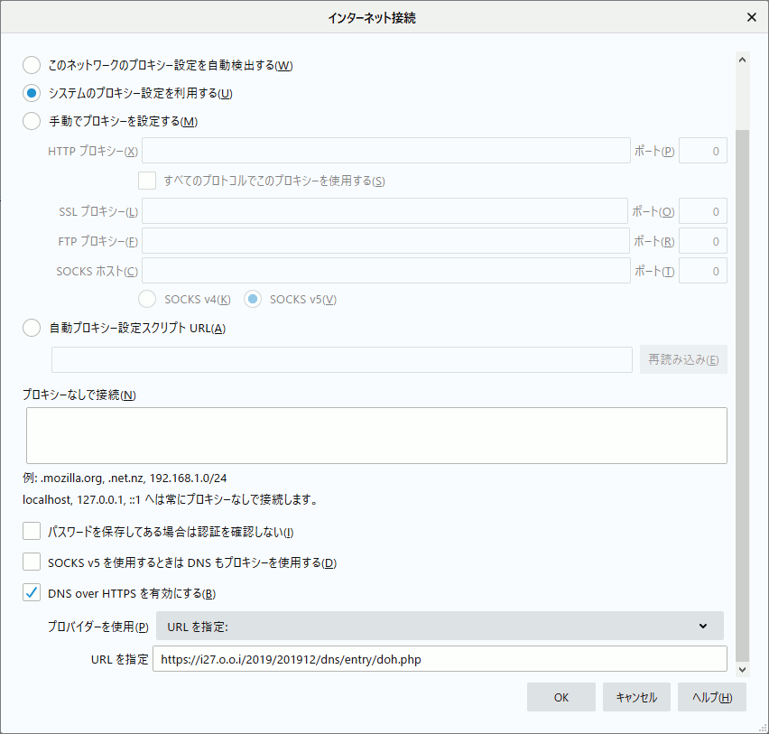
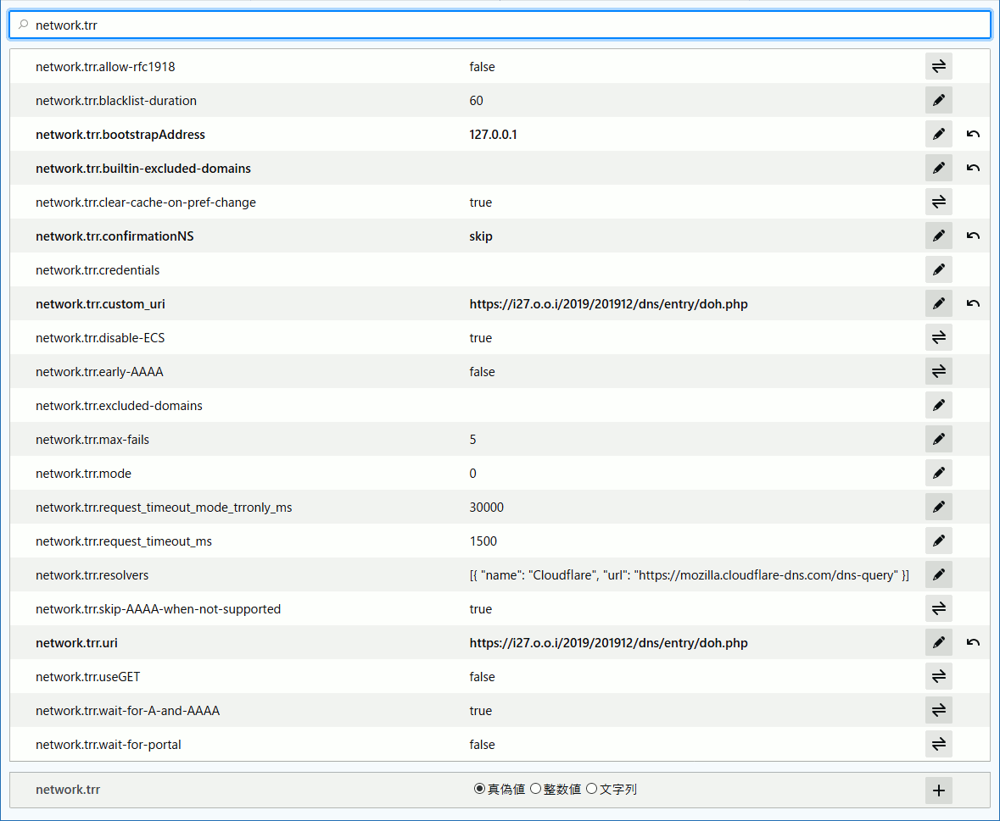
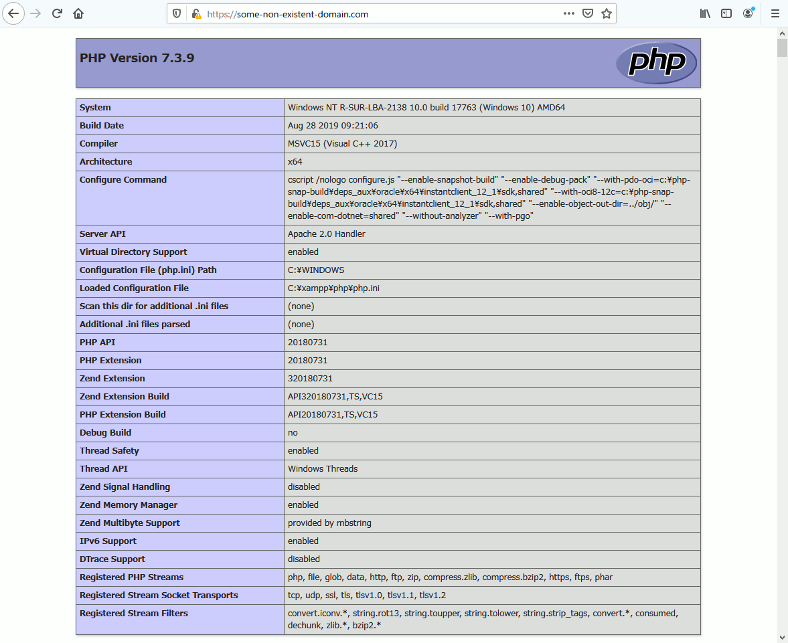
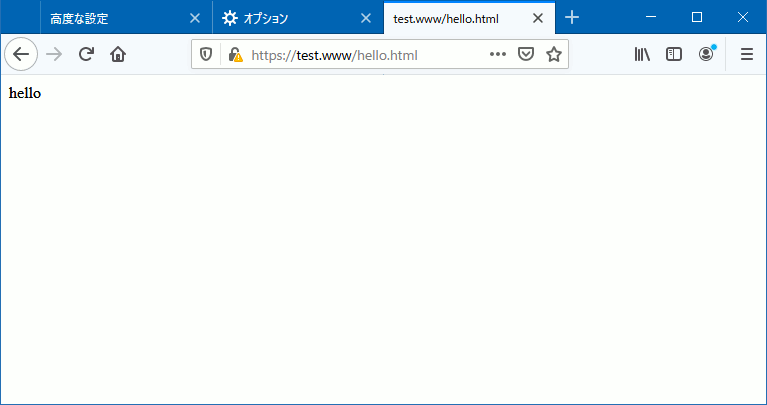
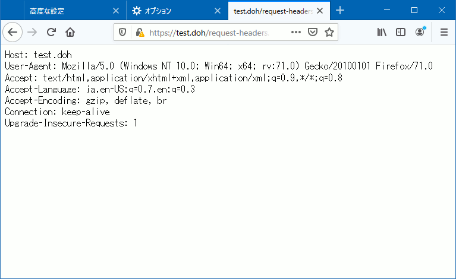

# DoH + Set-Cookie で興味関心が丸裸！？

こんにちは、広告エンジニアの中山です。<br />
皆さんは DNS over HTTPS（以下 DoH）を試されましたか？
DoH を利用することで、User-Agent と DNS キャッシュサーバ間の通信を「盗聴」「改竄」「なりすまし」から守ることができます。<br />
[Mozilla](https://wiki.mozilla.org/Trusted_Recursive_Resolver) によれば、<br />

> DNS-over-HTTPS (DoH) allows DNS to be resolved with enhanced privacy, secure transfers and improved performance.

プライバシー保護とセキュリティー向上が期待されています。<br />
また
[Microsoft](https://techcommunity.microsoft.com/t5/Networking-Blog/Windows-will-improve-user-privacy-with-DNS-over-HTTPS/ba-p/1014229)
や
[Google](https://blog.chromium.org/2019/09/experimenting-with-same-provider-dns.html)
も DoH の採用に賛同しています。<br />


## DoH への懸念

ところが ISP の Comcast はプラットフォーマーのこの動きに [警戒感を表明](https://www.vice.com/en_us/article/9kembz/comcast-lobbying-against-doh-dns-over-https-encryption-browsing-data) しました。<br />
プラットフォーマーによる DNS の集中化が様々なリスクを引き起こす、と主張しています。<br />

> The unilateral centralization of DNS raises serious policy issues relating to cybersecurity, privacy, antitrust, national security and law enforcement, network performance and service quality (including 5G), and other areas.

しかし、この主張は [反撃を受けます。](https://blog.mozilla.org/blog/2019/11/01/asking-congress-to-examine-isp-data-practices/)<br />
Mozilla 曰く、むしろ ISP がデータを独占し、穏やかならぬ用途に活用しているのではないか、というわけです。<br />

> These developments have raised serious questions. How is your browsing data being used by those who provide your internet service? Is it being shared with others? And do consumers understand and agree to these practices? We think it's time Congress took a deeper look at ISP practices to figure out what exactly is happening with our data.

確かに DNS は興味関心情報のハニーポットです。<br />
邪悪な ISP ならばユーザーアカウントと名前解決要求を紐づけ、興味関心情報として蓄積〜活用することも可能です。恐ろしや！<br />

では ISP の DNS を回避して DoH を利用すれば、このリスクから逃れることができるのでしょうか？<br />
ここで [RFC 8484](https://tools.ietf.org/html/rfc8484)を確認してみましょう。<br />

> HTTP cookies SHOULD NOT be accepted by DOH clients unless they are explicitly required by a use case.

どうやら DoH では Cookie の利用は禁止されていないようです。<br />
実際に [cloudflare の Example](https://developers.cloudflare.com/1.1.1.1/dns-over-https/wireformat/) には set-cookie が見つかります。<br />

```http
HTTP/2 200
date: Fri, 23 Mar 2018 05:14:02 GMT
content-type: application/dns-message
content-length: 49
cache-control: max-age=0
set-cookie: \__cfduid=dd1fb65f0185fadf50bbb6cd14ecbc5b01521782042;
    expires=Sat, 23-Mar-19 05:14:02 GMT; path=/; domain=.cloudflare.com; HttpOnly
server: cloudflare-nginx
cf-ray: 3ffe69838a418c4c-SFO-DOG
```

ということは DoH を利用する User-Agent が Web ブラウジングの HTTP Set-Cookie / HTTP Cookie メカニズムを踏襲する場合、邪悪なサービス提供者ならば Set-Cookie で付与した識別情報と名前解決要求を紐づけ、興味関心情報として蓄積〜活用できてしまいそうです。なんということでしょう！<br />

## DoH + Set-Cookie は有効か？

では Firefox 71.0 を使って実験してみましょう。<br />
アウトラインは以下の通りです。<br />

1. 自前 DoH の準備<br />ttps://test.doh/doh.php
2. Firefox の設定変更
3. ttps://test.www/hello.html の閲覧<br />ここで 1. による test.www の名前解決 + **Set-Cookie !!**
4. ttps://test.doh/request-headers.php の閲覧<br />ここで 3. による Set-Cookie の結果を確認

### 1. 自前 DoH の準備

今回は 127.0.0.1 の DocumentRoot 上に DoH 応答を生成するテスト用の自前 DoH サービスを用意しました。サンプルコードは [こちら](doh.php) です。<br />

### 2. Firefox の設定変更

以下の通り about:config を変更して DoH を有効にします。<br />

network.trr.
| network.trr 設定              | 変更後の値                | 補足説明                      |
| ---                           | ---                       | ---                           |
| network.trr.mode              | 3                         | 名前解決に DoH のみ利用       |
| network.trr.uri               | ttps://test.doh/doh.php   | DoH エントリー                |
| network.trr.bootstrapAddress  | 127.0.0.1                 | test.doh を 127.0.0.1 に解決  |
| network.trr.confirmationNS    | skip                      | 起動時の動作チェックを割愛    |

加えて Firefox に test.doh サーバ証明書保持します。<br />



テスト前に Cookie は全て削除します。<br />



Cookie のブロック機能は使わないのでチェックを外します。<br />



### 3. ttps://test.www/hello.html の閲覧

test.www の名前解決のために DoH 要求が自前 DoH サービスに送信されます。<br />
（00,00, ... のエンティティーボディー部分は、実際は [RFC 1035](https://tools.ietf.org/html/rfc1035) で定義されるパケットフォーマットです）<br />

```http
Host: test.doh
User-Agent: Mozilla/5.0 (Windows NT 10.0; Win64; x64; rv:71.0) Gecko/20100101 Firefox/71.0
Accept: application/dns-message
Accept-Language: ja,en-US;q=0.7,en;q=0.3
Accept-Encoding: gzip, deflate, br
Cache-Control: no-store
Content-Type: application/dns-message
Content-Length: 45
Connection: keep-alive

00,00,01,00,00,01,00,00,
00,00,00,01,04,74,65,73,
74,03,77,77,77,00,00,01,
00,01,00,00,29,10,00,00,
00,00,00,00,08,00,08,00,
04,00,01,00,00
```

自前 DoH サービスは DoH 応答とあわせてテスト用の Set-Cookie を応答します。<br />
後程この値（doh=49）が Firefox にどう扱われるのかを確認します。<br />

```http
Content-Type: application/dns-message
Content-Length: 50
Cache-Control: max-age=0
X-Resolve: test.www --> 127.0.0.1
X-Sent-Cookie: (none)
Connection: Close
Set-Cookie: doh=49; expires=Saturday, 11-Jan-2020 06:43:14 CET; Secure; HttpOnly

00,00,81,00,00,01,00,01,
00,00,00,00,04,74,65,73,
74,03,77,77,77,00,00,01,
00,01,04,74,65,73,74,03,
77,77,77,00,00,01,00,01,
00,00,00,80,00,04,7f,00,
00,01
```

今回の例では test.www を [127.0.0.1 に解決](https://github.com/nakayama-kazuki/2020/blob/master/doh.php#L420) しているため、127.0.0.1 の DocumentRoot 上にある hello.html が表示されました。<br />



### 4. ttps://test.doh/request-headers.php の閲覧

request-headers.php は以下のようなスクリプトです。

```php
header('Content-Type: text/plain');
$headers = apache_request_headers();
foreach ($headers as $field => $value) {
	print "{$field}: {$value}\n";
}
```

もし先程の自前 DoH サービスからの Set-Cookie が有効ならば、上記 apache_request_headers() には Firefox から送信された Cookie ヘッダが含まれているはずです。さて、結果は ...<br />



どうやら DoH によって Set-Cookie された値（doh=49）は送信されていなかったようです。<br />
保存された Cookie もありませんでした。<br />


## まとめ

Firefox 71.0 の実装では DoH 応答の Set-Cookie は無視されるため、邪悪な DoH サービス提供者であっても、興味関心情報の蓄積〜活用は難しいということが確認できました。<br />
故に DoH を利用した名前解決は従来の方法よりもプライバシーセーフである、と言えそうです。<br />
皆さんも他のブラウザを用いて実験してみてください。<br />

余談ですが Web アプリケーションの開発〜テストの際にはしばしば hosts を変更しますが、たまに設定ミスや元に戻すのを忘れてハマる人を見かけます。<br />
同じ環境で開発〜テストをしているグループ向けの設定を DoH サービスで提供し、テスト実施者は User-Agent の DoH を on/off することで利用する環境を切り替える ... なんて運用で（前述のミスも減って）生産性を高められそうですね。<br />

さらに余談ですが Cookie をおかわりしたい方は [tecoscore](https://www.techscore.com/blog/author/nakayama-kazuki/) もどうぞ :-p
